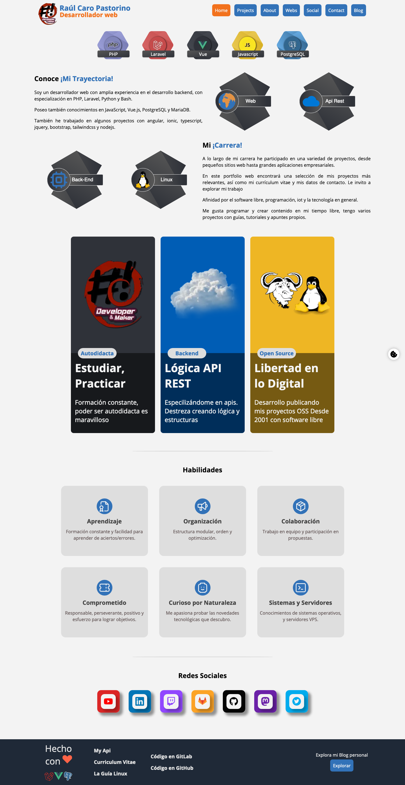
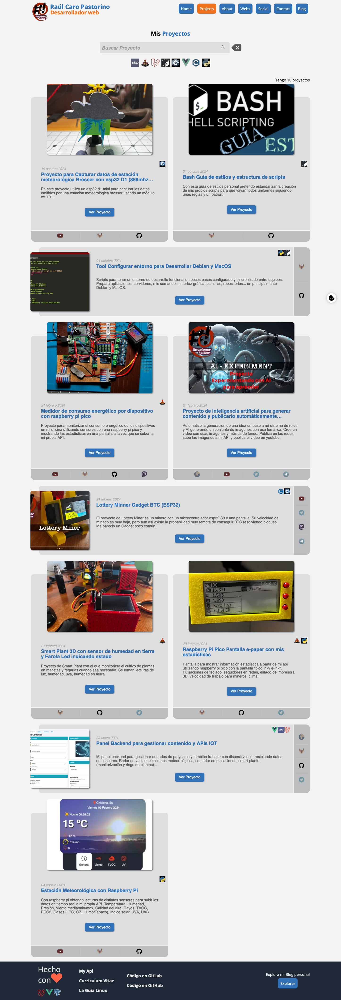
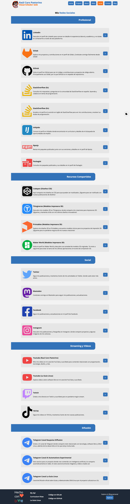
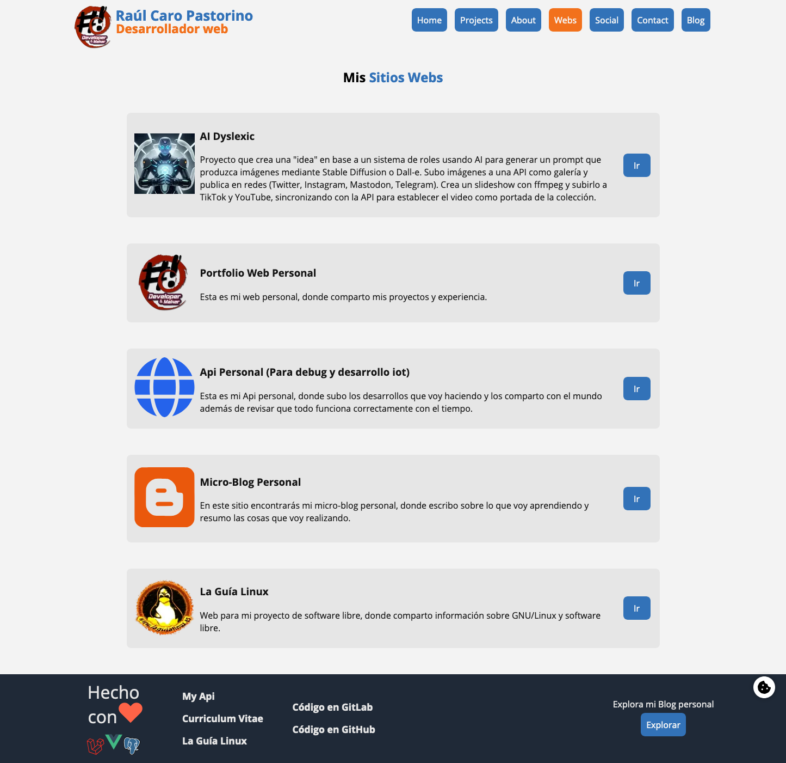
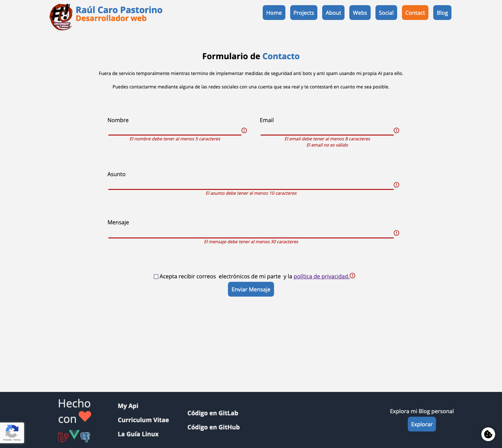

# Proyecto: La Guía Linux en Nuxt 3 (vuejs)

Sitio web del autor y del proyecto: [https://laguialinux.com](https://laguialinux.com)



Repository [https://gitlab.com/raupulus/www.laguialinux.es](https://gitlab.com/raupulus/www.laguialinux.es)

## Tabla de Contenidos

- [Requisitos](#requisitos)
- [Estructura del Proyecto](#estructura-del-proyecto)
- [Desarrollo Local](#desarrollo-local)
  - [Configuración sin Docker](#configuración-sin-docker)
  - [Configuración con Docker](#configuración-con-docker)
- [Variables de Entorno](#variables-de-entorno)
- [Comandos Disponibles](#comandos-disponibles)
- [Despliegue](#despliegue)
- [Contribuir](#contribuir)
- [Galería](#galería)
- [Licencia](#licencia)

## Requisitos

- Node.js 18+ (recomendado 20+)
- npm o yarn
- Docker y Docker Compose (opcional, para desarrollo con contenedores)

## Estructura del Proyecto

```
laguialinux.com/
├── assets/            # Recursos estáticos (CSS, imágenes, etc.)
├── components/        # Componentes Vue reutilizables
├── composables/       # Composables de Vue para lógica reutilizable
├── layouts/           # Layouts de la aplicación
├── pages/             # Páginas de la aplicación (rutas automáticas)
├── public/            # Archivos públicos accesibles directamente
├── server/            # Middleware y API endpoints del servidor
├── types/             # Definiciones de tipos TypeScript
├── utils/             # Funciones de utilidad
├── .env.example       # Ejemplo de variables de entorno para desarrollo
├── nuxt.config.ts     # Configuración de Nuxt
└── package.json       # Dependencias y scripts
```

## Desarrollo Local

### Configuración sin Docker

1. Instalar dependencias:

```bash
# npm
npm install

# yarn
yarn install

# pnpm
pnpm install
```

2. Preparar variables de entorno:

Este proyecto depende de obtener la información a través de una API/backend desarrollada en Laravel/PHP.

Para configurar el dominio y la API, copia el archivo **env.example** a **.env**:

```bash
cp env.example .env
```

3. Iniciar servidor de desarrollo:

```bash
npm run dev
```

El servidor estará disponible en http://localhost:3020

### Configuración con Docker

1. Construir y levantar los contenedores:

```bash
# Para desarrollo
docker-compose up app-dev

# Para producción
docker-compose up app-prod
```

El servidor de desarrollo estará disponible en http://localhost:3020
El servidor de producción estará disponible en http://localhost:3000

## Variables de Entorno

Las principales variables de entorno que necesitas configurar son:

- `APP_NAME`: Nombre de la aplicación
- `APP_URL`: URL base de la aplicación
- `API_DOMAIN_URL`: Dominio de la API
- `API_BASE_URL`: URL base de la API
- `GTAG_ID`: ID de Google Analytics (opcional)

## Comandos Disponibles

```bash
# Desarrollo
npm run dev

# Generar contenido estático para producción con SSR
npm run generate

# Previsualizar proyecto en producción
npm run preview
```

## Despliegue

### Despliegue con Docker

1. Construir la imagen de Docker:

```bash
docker build -t laguialinux:latest .
```

2. Ejecutar el contenedor:

```bash
docker run -p 3000:3000 laguialinux:latest
```

### Despliegue manual

1. Generar la versión de producción:

```bash
npm run generate
```

2. Copiar el contenido de la carpeta `.output` a tu servidor web.

## Contribuir

¡Las contribuciones son bienvenidas! Si deseas contribuir a este proyecto, sigue estos pasos:

1. Haz un fork del repositorio
2. Crea una rama para tu característica (`git checkout -b feature/amazing-feature`)
3. Haz commit de tus cambios (`git commit -m 'Add some amazing feature'`)
4. Haz push a la rama (`git push origin feature/amazing-feature`)
5. Abre un Pull Request

### Guía de estilo

- Utiliza TypeScript para todo el código
- Sigue las convenciones de nomenclatura de Vue.js
- Mantén los componentes pequeños y enfocados en una sola responsabilidad
- Documenta las funciones y componentes complejos
- Escribe pruebas para la lógica crítica

## Galería

<p align="center">
  
  
  
  
</p>

## Licencia

Este proyecto está licenciado bajo la Licencia GPLv3. Consulta el archivo
LICENSE para más detalles.
